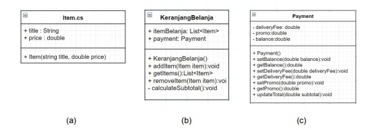
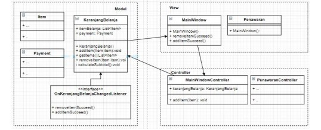

# Cafe Kenangan Cashier App

Aplikasi ini berfungsi untuk meringkas pesanan yang memiliki berbagai fitur yang dibutuhkan oleh marketplace pada umumnya.

## Scope & Functionalities
* User dapat melihat daftar makanan yang ditawarkan.
* User dapat memasukkan atau menghapus makanan pilihan ke dalam keranjang.
* User dapat melihat subtotal makanan yang terdapat pada keranjang.
* User dapat melihat daftar voucher yang ditawarkan.
* User dapat menggunakan salah satu voucher.
* User dapat melihat harga total termasuk potongannya.

## How does it works?
MVC adalah salah satu strategi untuk membuat source code yang memenuhi standar Single Responsibility.
Pada aplikasi ini, terdapat beberapa class yang memiliki fungsi sebagai berikut:


* Pada class `Item.cs`, terdapat berbagai item makanan maupun minuman.
* Pada class `KeranjangBelanja.cs`, item-item yang dibeli akan ditampung dalam sebuah wadah keranjang.
* Pada class `Payment.cs`, berfungsi untuk kalkulasi item-item, promo, ongkos kirim dan sebagainya.
* Pada class `Coupon.cs`, berfungsi untuk menampung model daftar kuponnya.

Relasi antar class adalah sebagai berikut:



Pada bagian View(direpresentasikan dengan .xaml dan .xaml.cs) bertanggung jawab atas state Button, ListBox, Label dan komponen view lainnya.
Pada bagian ini, sebaiknya tidak menaruh logika perhitungan maupun manipulasi data.
Proses agregasi manipulasi data dapat dikerjakan pada bagian Model.
Contohnya adalah pada class `KeranjangBelanja.cs`, bertanggung jawab untuk menampung koleksi item yang akan dibeli serta melakukan kalkulasi subtotal.
Tidak ada proses klik tombol, refresh listbox maupun operasi-operasi View pada bagian Model.
Apabila bagian model perlu memberi respon kepada View, maka dapat memanfaatkan interface seperti `OnKeranjangBelanjaChangedListener`.

Bagian View juga tidak diperkenankan melakukan _direct access_ ke Model, melainkan melalui perantara Controller.
Pada bagian Controller, diperbolehkan menaruh logika-logika tambahan untuk dikirim ke Model.
Dengan demikian, masing-masing bagian menjalankan peran sesuai kapasitasnya dan tidak saling tumpang tindih tanggung jawab.

Alur logika pada program ini adalah:
1. Dari `MainWindow.xaml`, user meng-klik tombol 'Tambah item' sehingga tampilan beralih ke window `Penawaran.xaml`.
Kemudian user memilih menu yang tersedia.
2. Selanjutnya, user meng-klik tombol 'Tambah kupon' sehingga tampilan beralih ke `PilihCoupon.xaml`.
Kemudian user memilih kupon yang tersedia. User hanya dapat memilih 1 kupon saja dalam 1 kesempatan.
3. User dapat melihat subtotal dan kupon pada bagian kiri bawah tampilan `MainWindow.xaml` dengan logika yang berasal dari class model `KeranjangBelanja.cs`.
```C#
private void CalculateSubTotal()
{
    double subtotal = 0;
    double potongan = 0;
    foreach (Item item in itemBelanja)
    {
        subtotal += item.Price;
    }

    foreach (Coupon coupon in itemCoupon)
    {
        if (coupon.DiscInPercent != 0)
        {
            if(coupon.DiscInPercent == 30)
            {
                if(subtotal >= 100000)
                {
                    potongan -= 30000;
                } else {
                    potongan -= subtotal * (coupon.DiscInPercent / 100);
                    }
                } else { 
                    potongan -= subtotal * (coupon.DiscInPercent/100);
                }
            }

            if(coupon.Disc != 0)
            {
                potongan -= coupon.Disc;
            }
        }
        payment.UpdateTotal(subtotal, potongan); 
    }
}
```
4. User dapat melihat total pada bagian kanan bawah tampilan `MainWindow.xaml` dengan logika yang berasal dari class model `Payment.cs`.
```C#
public void UpdateTotal(double subtotal, double potongan)
{
    double total = subtotal + potongan;
    this.paymentCallback.OnPriceUpdated(subtotal, total, potongan);
}
```
